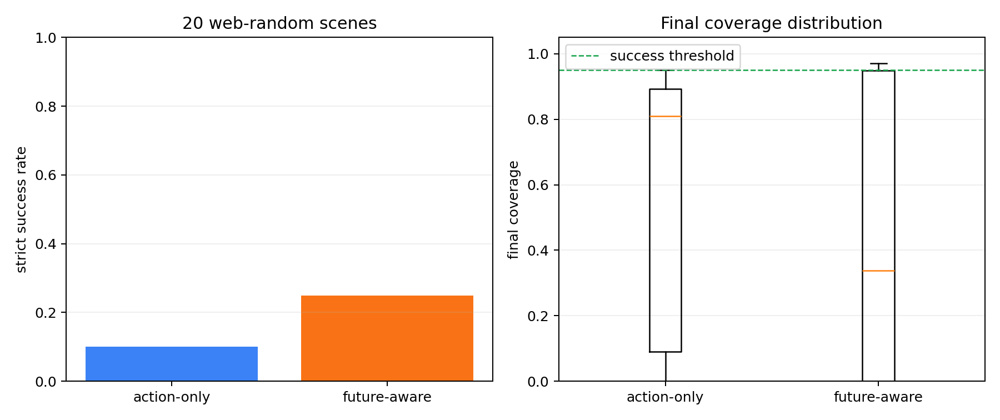
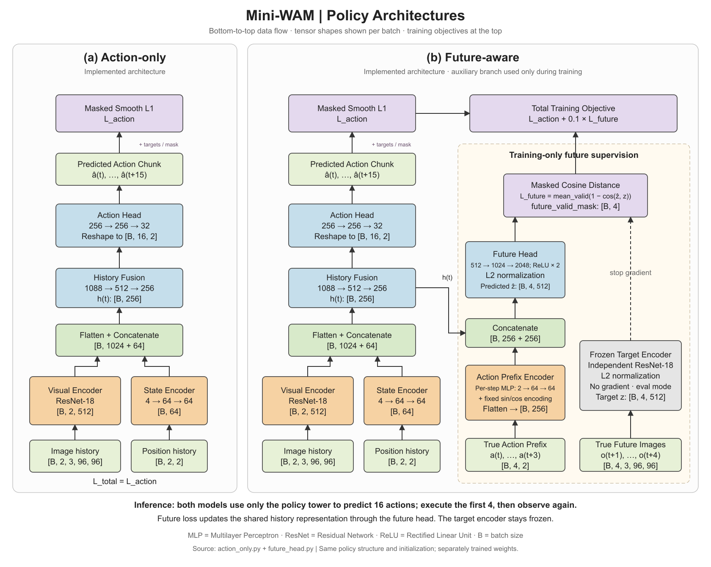

# Mini-WAM：Push-T 策略训练与未来辅助监督

研究一个小问题：在相同示范数据和动作预测结构下，训练时增加动作条件未来表示预测，能否改善闭环控制？
WAM（World Action Model，世界动作模型）在这里是学习项目名称；本项目研究训练期辅助监督，推理时直接预测动作。

**状态：单随机种子探索性项目已收尾。工程流程已贯通，实验未证明未来辅助监督稳定优于基线。**
两个模型均训练到 50,000 步，按各自最低离线验证损失选点；封存最终测试集未使用。

## 结果与证据

以下为额外冻结的 **20 个相同开发初始状态**，每回合最多 300 步，严格成功标准为覆盖率 `> 0.95`。

| 指标 | action_only | future_aware |
|---|---:|---:|
| 严格成功 | 2/20（10%） | 5/20（25%） |
| 平均最终覆盖率 | 0.556 | 0.478 |
| 中位最终覆盖率 | 0.810 | 0.337 |
| 最终覆盖率标准差 | 0.399 | 0.428 |
| 选中检查点步数 | 10,000 | 34,000 |

配对结果：共同成功 1 个、仅基线成功 1 个、仅未来辅助模型成功 4 个、共同失败 14 个。
McNemar 精确双侧检验 `p=0.375`，差异不显著。标准差描述这些场景，不能代替训练种子方差。



未来分支在 2,368 个验证窗口、9,352 个有效未来步上的余弦距离：正确动作 **0.03147**、
批内打乱 **0.03259**、合法反向 **0.04411**。打乱动作影响较弱，不能据此证明因果物理预测或稳定控制收益。

[完整报告](reports/PROJECT_CLOSURE.md) · [逐回合结果](reports/closure/paired_comparison.csv) ·
[场景清单](reports/closure/scenes.json) · [反事实图](reports/closure/figures/counterfactual_losses.png) ·
[训练曲线](reports/closure/figures/future_aware_loss_curves.png)

## 架构与数据

历史两帧图像与位置 → 共享历史表示 → 16 步动作块；闭环每执行 4 步重新观测。
未来模型训练时另用真实前 4 步动作预测 4 个未来表示，推理时不运行未来分支。



[可编辑架构原图](reports/architecture/paper_style_architectures.svg) · [结构与梯度说明](reports/architecture/model_architectures.md) ·
[16 个时间窗口样本](reports/architecture/data_samples.png)

数据：206 个示范回合、25,650 帧；固定 185 个训练回合、21 个验证回合。
归一化只用训练集，窗口不跨回合，动作和未来监督分别用掩码排除填充。
工程实现包含完整训练状态恢复、多进程预取游标保护，以及经过张量一致性核对的图像缓存。

## 成功与失败视频

三组各保留两模型的视频，既展示共同成功，也展示双方各自的失败。文件已纳入仓库，无需访问私人 Drive。

| 相同初始场景 | action_only | future_aware |
|---|---|---|
| web-random-04：共同成功 | [成功](reports/closure/representative_videos/shared_success__action_only__web-random-04.mp4) | [成功](reports/closure/representative_videos/shared_success__future_aware__web-random-04.mp4) |
| web-random-09：仅基线成功 | [成功](reports/closure/representative_videos/action_only_only_success__action_only__web-random-09.mp4) | [失败](reports/closure/representative_videos/action_only_only_success__future_aware__web-random-09.mp4) |
| web-random-00：仅未来辅助模型成功 | [失败](reports/closure/representative_videos/future_aware_only_success__action_only__web-random-00.mp4) | [成功](reports/closure/representative_videos/future_aware_only_success__future_aware__web-random-00.mp4) |

六段视频均已解码检查，帧数与对应回合的执行步数一致。[案例分析](reports/failure_analysis.md)。

## 快速核对与复现

Python 3.10 或以上即可核验原证据并重算统计，无需下载权重或数据：

```bash
python3 scripts/summarize_closure.py --output-dir outputs/closure-summary
```

成功标志：`CLOSURE_AUDIT_OK files=14 scene_pairs=20 p=0.375`。

- [环境、数据安装与工作台](docs/GETTING_STARTED.md)
- [训练、Drive 镜像与断点恢复](COLAB.md)
- [检查点来源、配对闭环与反事实复现命令](docs/REPRODUCING.md)
- [验证记录与版本归档](reports/DELIVERY_VERIFICATION.md)
- [当前进度](PROGRESS.md) · [规格与原计划](SPEC.md) · [验收边界](EVALUATION.md)

本轮常规测试 57 项通过；默认跳过的 4 项多进程测试已单独补测通过，共 61 项。

已有本地环境可运行 `./.venv/bin/python -m pytest -q`，或用 `./.venv/bin/python app.py` 启动工作台。
工作台当前加载动作基线；未来模型的检查点通过配对评估脚本加载。
已归档结果和代表视频可直接核对；历史权重保持原 Drive 权限，完整跨机器重训尚未验证。

## 局限与后续

每种模型仅一个训练种子，20 个配对场景属于开发证据；早期开发集与本表场景不同，不混合汇总。
未执行多种子正式实验、封存测试、亮度扰动或有真实替代未来轨迹的模拟器反事实检查。
目标表征可辨性及 future_aware 的 64 样本过拟合缺少独立归档证据，严格门禁不能全部标为通过。
未记录完整逐步动作/覆盖率轨迹，无法可靠量化停滞与回退次数；失败根因尚未证实。

结论仅适用于当前 Push-T 设置。若重启，先补证据缺口，再做多种子验证；本轮不再扩模型或追加长训练。
