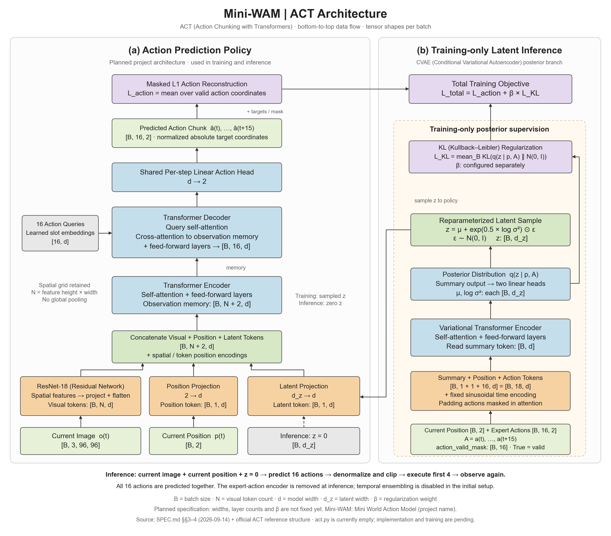

# ACT 架构图

ACT（Action Chunking with Transformers，基于 Transformer 的动作分块）。图按 2026-09-14 的项目规格绘制，沿用原架构图的自下而上数据流、配色和训练分支虚线框。

**状态：待实现架构。** 绘制时 `src/mini_wam/models/act.py` 为空文件，不代表模型已经实现或训练。



- [可编辑矢量图](act_architecture.svg)
- [生成脚本](../../scripts/draw_act_architecture.py)

## 项目已确定的约定

来源：[SPEC.md 第 3–4 节](../../SPEC.md)、[PROGRESS.md](../../PROGRESS.md)。

- 当前单帧图像 `[B, 3, 96, 96]` 与当前位置 `[B, 2]` 作为观测；预测 `[B, 16, 2]` 动作块。
- 视觉主干为 ResNet-18（Residual Network，残差网络），保留空间特征；位置和潜变量各投影为一个 token（表示向量）。
- CVAE（Conditional Variational Autoencoder，条件变分自编码器）训练分支读取当前位置、专家动作和有效掩码，固定时间位置编码保留。填充动作同时在注意力和动作损失中屏蔽。
- 动作损失为有效坐标上的 L1 绝对误差均值，加后验相对于标准正态分布的 KL（Kullback–Leibler）散度正则。图中的 `mean_B` 表示对批次取均值，潜变量维度求和。
- 推理使用 `z=0`；反归一化并裁剪动作后，执行前 4 步再观测。初版不启用时间集成。

## 参考结构及未定参数

图中的 summary token（汇总表示）、后验均值与对数方差、重参数采样、动作查询和逐位置线性动作头，依据[作者官方模型实现](https://github.com/tonyzhaozh/act/blob/main/detr/models/detr_vae.py)。它们是用于讲解与后续实现的参考结构，不是对本地已运行代码的描述。

`N` 为视觉空间 token 数，`d` 为模型隐藏宽度，`d_z` 为潜变量宽度，`β` 为正则权重。项目尚未锁定这些维度、空间网格细节和 Transformer 层数，因此图中不填入原论文或其他项目的默认数值。变分编码器与策略编码器是不同模块；图中统一写 `d` 表示此参考图采用一致的表示宽度，最终以独立配置为准。

动作查询表示输出槽位；解码器同时输出 16 步动作，不把真实动作逐步送入策略解码器。固定正弦时间编码用于右侧动作序列，左侧动作查询可以是可学习表示；两者职责不同。

重建图像文件：

```bash
MPLCONFIGDIR=/tmp/mini-wam-mpl python3 scripts/draw_act_architecture.py
```

仅依赖 Matplotlib；矢量输出保留可编辑文字。生成时检查模块内文字宽度，并对最终图片进行视觉检查。
