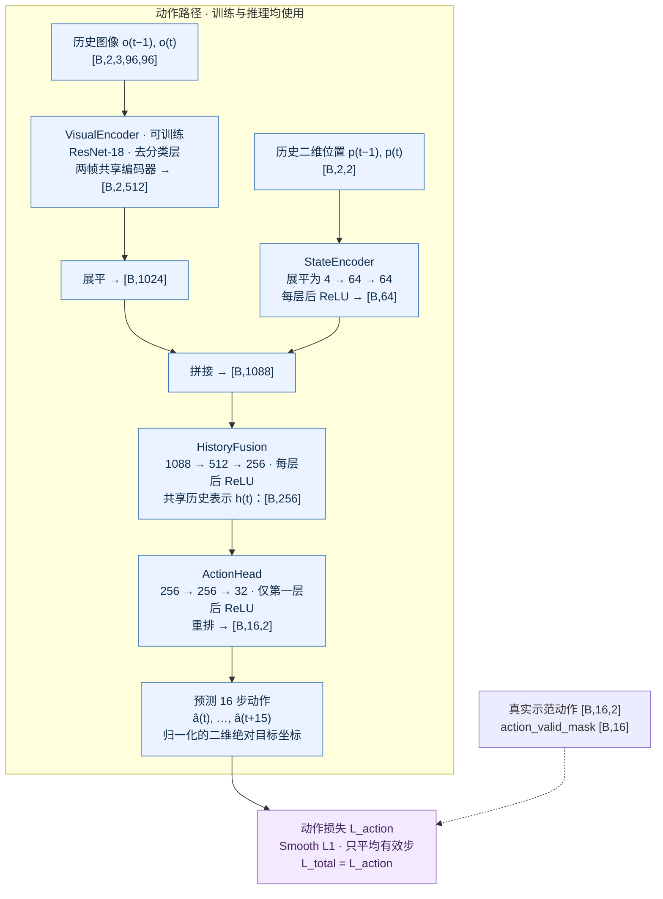
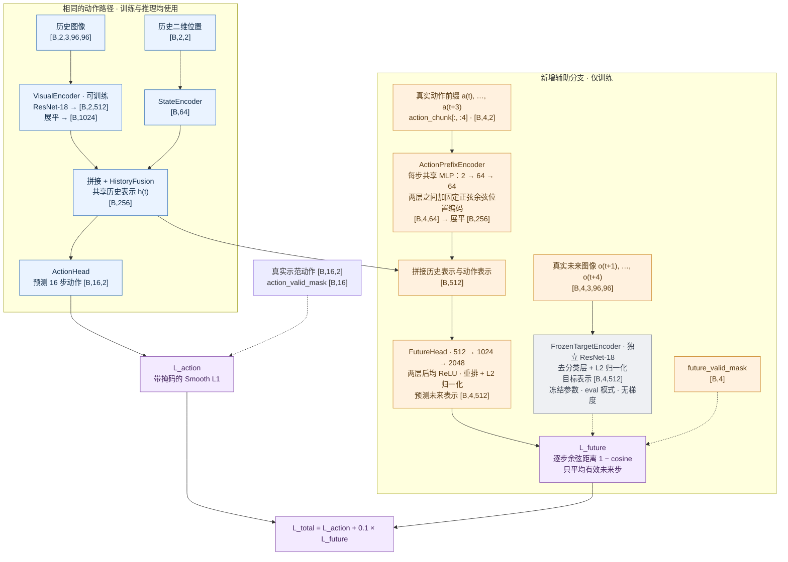

# Mini-WAM 架构对照

依据：`src/mini_wam/models/action_only.py`、`src/mini_wam/models/future_head.py`，核对日期 2026-09-10。两种模型均按当前实现绘制。两者动作路径结构相同，但各自训练后权重可以不同。

图例：蓝色为训练与推理均使用的动作路径；橙色为仅训练的未来预测分支；灰色为冻结的目标编码器；紫色为训练损失。箭头表示前向数据流，虚线表示监督输入。B 表示批次大小，所有形状均包含批次维。MLP（Multilayer Perceptron，多层感知机）；ResNet（Residual Network，残差网络）；ReLU（Rectified Linear Unit，修正线性单元）。

## 1. action-only：当前实现

## 2. future-aware：当前实现

动作路径与上图相同；为避免重复，下图将动作路径中的层细节折叠为模块。

## 3. 阅读要点

- 未来分支输入的是数据集中的真实前 4 步动作，不是 ActionHead 的预测动作。
- L_future 的梯度经 FutureHead 和 h(t) 回传到 HistoryFusion、VisualEncoder 与 StateEncoder，也更新 ActionPrefixEncoder；不会经过 ActionHead，也不会更新 FrozenTargetEncoder。
- future-aware 推理时不调用 ActionPrefixEncoder、FutureHead 或 FrozenTargetEncoder。两者均从历史观测直接预测动作，不在推理期进行未来想象或搜索。
- 闭环执行时，预测动作先反归一化并裁剪到合法范围，执行前 4 步，再读取新观测并重新预测。
- 动作前缀的时间编码固定，不参与学习；未来头最后一层之后也使用 ReLU，图中忠实记录当前实现。
- 两者的共同结构与相同初始化用于控制比较；“共享”不表示两个独立模型在训练过程中绑定权重。
